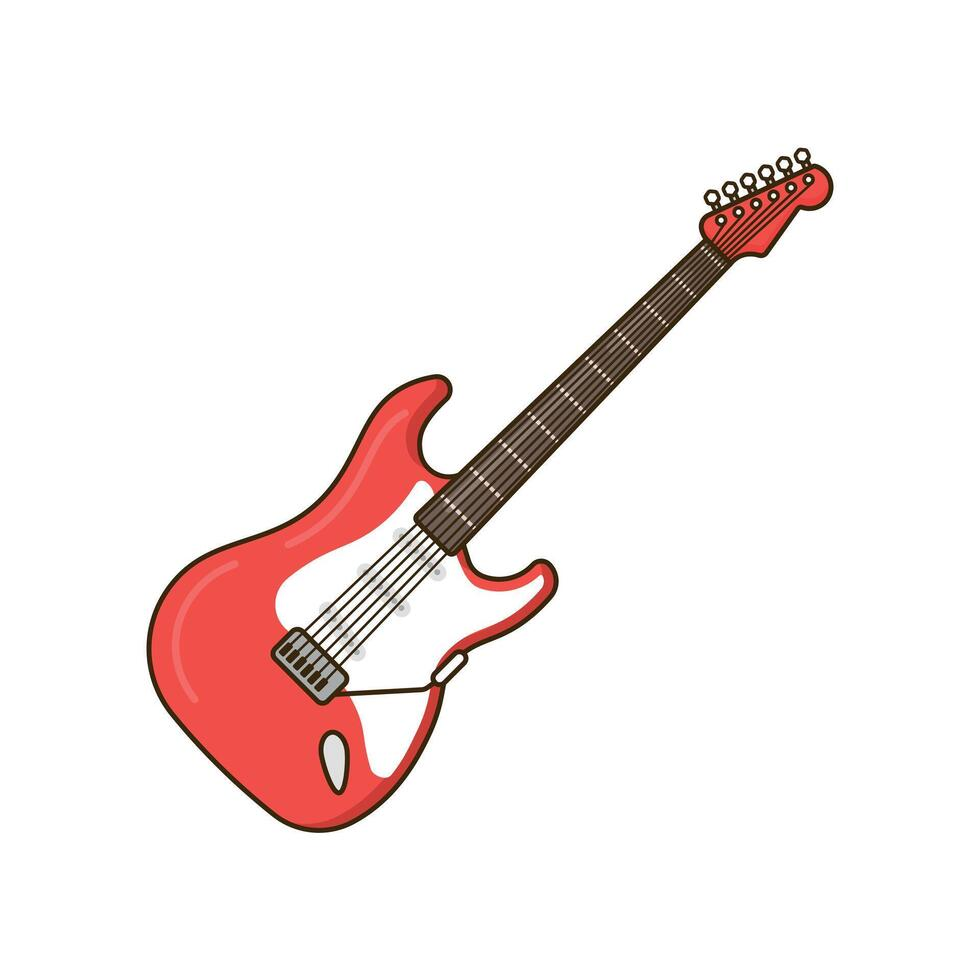
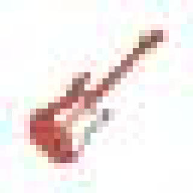

# Pixelling
Pixelling is a command-line tool that converts images and animated GIFs 
into pixel-art style outputs using either pixelation or fixed-grid resizing.

## Features
Two modes:
- `pixel` mode keeps the original image size but makes it look blocky.
- `grid` mode center-crops to the target aspect ratio, then downsamples to a small fixed size like 32x32.

Optional color reduction with `--color-count` to create a limited-palette look.

Works with animated GIFs by processing each frame of the animation.

File saving:
- Creates a default output filename automatically.
- Avoids replacing existing files unless you use `--overwrite`.

## Examples 

<table align="center">
  <tr>
    <td align="center">
      
    </td>
    <td style="width:32px;"></td>
    <td align="center">
      
    </td>
  </tr>
  <tr>
    <td align="center">Original</td>
    <td></td>
    <td align="center">Pixelated</td>
  </tr>
  <tr>
    <td colspan="3" align="left">
      <ul>
        <li>Running pixel mode with a block size of 10</li>
        <li><code>pixelling content/rain.jpg --mode pixel --block-size 10</code></li>
      </ul>
    </td>
  </tr>
</table>

<br />
<br />

<table align="center">
  <tr>
    <td align="center">
      
    </td>
    <td style="width:32px;"></td>
    <td align="center">
      
    </td>
  </tr>
  <tr>
    <td align="center">Original</td>
    <td></td>
    <td align="center">Pixelated</td>
  </tr>
  <tr>
    <td colspan="3" align="left">
      <ul>
        <li>Running pixel mode with a block size of 6 and limiting the color palette to 6</li>
        <li><code>pixelling content/cat.jpeg --mode pixel --block-size 6 --color-count 6</code></li>
      </ul>
    </td>
  </tr>
</table>

<br />
<br />

<table align="center">
  <tr>
    <td align="center">
      
    </td>
    <td style="width:32px;"></td>
    <td align="center">
      
    </td>
  </tr>
  <tr>
    <td align="center">Original</td>
    <td></td>
    <td align="center">Pixelated</td>
  </tr>
  <tr>
    <td colspan="3" align="left">
      <ul>
        <li>Running pixel mode on an animated GIF with a block size of 8</li>
        <li><code>pixelling content/bee.gif --mode pixel --block-size 8</code></li>
        <li>NOTE: This is a compressed version to run smoothly on the Github repo. 
            The real version is inside the <code>content</code> folder under <code>bee.gif</code> 
            and <code>bee_pixelling.gif</code></li>
      </ul>
    </td>
  </tr>
</table>

<br />
<br />

<table align="center">
  <tr>
    <td align="center">
      
    </td>
    <td style="width:32px;"></td>
    <td align="center">
      
    </td>
  </tr>
  <tr>
    <td align="center">Original</td>
    <td></td>
    <td align="center">Pixelated</td>
  </tr>
  <tr>
    <td colspan="3" align="left">
      <ul>
        <li>Running grid mode with grid width and heigh of 32 (equivalent to 32 pixels) and a color count of 6</li>
        <li><code>pixelling content/guitar.jpg --mode grid --grid-width 32 --grid-height 32 --color-count 6</code></li>
        <li>NOTE: This is a nearest-neighbor preview for README display. 
            The real output is inside the <code>content</code> folder under <code>guitar_pixelling.jpg</code></li>
      </ul>
    </td>
  </tr>
</table>


## Installation (Beginner)
- This guide assumes you are new to GitHub and Python command-line setup.
- If you already use Git, virtual environments, and `pip`, jump to **Installation (Quick)** below.

1. Install Git
- Download and install Git from: https://git-scm.com/downloads
- After installation, open a terminal and run:

```bash
git --version
```

2. Install Python 3.10 or newer
- Download and install Python from: https://www.python.org/downloads/
- On Windows, make sure you check **"Add Python to PATH"** during installation.
- Verify installation:

```bash
python3 --version
```

3. Clone this repository

```bash
git clone https://github.com/enzeeo/pixelling.git
cd pixelling
```

4. Create and activate a virtual environment

macOS/Linux:

```bash
python3 -m venv .venv
source .venv/bin/activate
```

Windows (PowerShell):

```powershell
python -m venv .venv
.venv\Scripts\Activate.ps1
```

5. Install dependencies

```bash
pip install -r requirements.txt
pip install -e .
```

6. Run your first command

```bash
pixelling content/rain.jpg --mode pixel --block-size 10
```

7. If the `pixelling` command is not found, run it in Python module mode

```bash
python -m pixelling content/rain.jpg --mode pixel --block-size 10
```

## Installation (Quick)
For users who already know Git and Python virtual environments

Requirements:
- Python `>=3.10`
- Git

```bash
git clone https://github.com/enzeeo/pixelling.git
cd pixelling
python3 -m venv .venv
source .venv/bin/activate
pip install -r requirements.txt
pip install -e .
pixelling --help
```

## Commands
Use one of these full commands depending on mode.

### Pixel Mode
- Required flags: `input_image_path`, `--mode pixel`, `--block-size`
- Optional flags shown: `--color-count`, `-o`, `--overwrite`

```bash
pixelling content/cat.jpeg --mode pixel --block-size 6 --color-count 8 -o output/cat_pixel.png --overwrite
```

Flag breakdown:
- `content/cat.jpeg`: Input image path.
- `--mode pixel`: Uses block-style pixelation and keeps the original output dimensions.
- `--block-size 6`: Sets each pixel block size to `6`.
- `--color-count 8`: Reduces the output palette to `8` colors.
- `-o output/cat_pixel.png`: Writes to a custom output path.
- `--overwrite`: Replaces the output file if it already exists.

### Grid Mode
- Required flags: `input_image_path`, `--mode grid`, `--grid-width`, `--grid-height`
- Optional flags shown: `--color-count`, `-o`, `--overwrite`

```bash
pixelling content/guitar.jpg --mode grid --grid-width 32 --grid-height 32 --color-count 6 -o output/guitar_grid.png --overwrite
```

Flag breakdown:
- `content/guitar.jpg`: Input image path.
- `--mode grid`: Center-crops to the target aspect ratio, then resizes to a fixed grid.
- `--grid-width 32`: Sets output grid width to `32`.
- `--grid-height 32`: Sets output grid height to `32`.
- `--color-count 6`: Reduces the output palette to `6` colors.
- `-o output/guitar_grid.png`: Writes to a custom output path.
- `--overwrite`: Replaces the output file if it already exists.

### Help
- Show all CLI options and usage:

```bash
pixelling --help
```

## Architecture
1. CLI layer (`src/pixelling/cli.py`)
- Parses arguments, validates mode-specific flags, and chooses still-image or animated-GIF flow.

2. Input/output layer (`src/pixelling/io.py`, `src/pixelling/gif_io.py`)
- Loads input images and GIF frames.
- Builds default output paths and handles overwrite-safe file naming.
- Saves either a single output image or an animated GIF with metadata.

3. Transformation pipeline (`src/pixelling/ops/pipeline.py`, `src/pixelling/ops/animated_pipeline.py`)
- Applies the selected mode (`pixel` or `grid`) and optional color quantization.
- For GIFs, applies the same image pipeline frame-by-frame in order.

4. Image operations (`src/pixelling/ops/*`)
- `pixelate.py`: downscale + nearest-neighbor upscale for block-style pixelation.
- `grid.py`: center-crop to target aspect ratio, then BOX-filter resize to fixed grid.
- `quantize.py`: optional color reduction with alpha-channel handling.
- `resize.py`: shared resize helpers and resampling filter selection.


## Bug Reports and Feature Suggestions
Contributions are welcome!

If you find a bug, please open a GitHub Issue using the template that includes:
- Your operating system and Python version.
- The exact command you ran.
- The input file type (JPG, PNG, GIF, etc.).
- The result you got if any.
- Any error output or traceback text.

For feature suggestions, please open a GitHub Issue using the template that includes:
- The problem you want to solve.
- The behavior you expect.
- An example command you would like to run.
