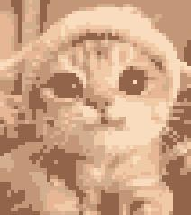
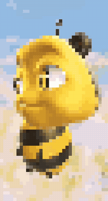

# Pixelling
Pixelling is a command-line tool that converts images and animated GIFs 
into pixel-art style outputs using either pixelation or fixed-grid resizing.

## Features
Two modes:
- `pixel` mode keeps the original image size but makes it look blocky.
- `grid` mode resizes the image to a small fixed size like 32x32.

Optional color reduction with `--color-count` to create a limited-palette look.

Works with animated GIFs by processing each frame of the animation.

File saving:
- Creates a default output filename automatically.
- Avoids replacing existing files unless you use `--overwrite`.

## Examples 

<table align="center">
  <tr>
    <td align="center">
      
    </td>
    <td style="width:32px;"></td>
    <td align="center">
      
    </td>
  </tr>
  <tr>
    <td align="center">Original</td>
    <td></td>
    <td align="center">Pixelated</td>
  </tr>
  <tr>
    <td colspan="3" align="left">
      <ul>
        <li>Running pixel mode with a block size of 10</li>
        <li><code>pixelling content/rain.jpg --mode pixel --block-size 10</code></li>
      </ul>
    </td>
  </tr>
</table>

<table align="center">
  <tr>
    <td align="center">
      
    </td>
    <td style="width:32px;"></td>
    <td align="center">
      
    </td>
  </tr>
  <tr>
    <td align="center">Original</td>
    <td></td>
    <td align="center">Pixelated</td>
  </tr>
  <tr>
    <td colspan="3" align="left">
      <ul>
        <li>Running pixel mode with a block size of 6 and limiting the color palette to 6</li>
        <li><code>pixelling content/cat.jpeg --mode pixel --block-size 6 --color-count 6</code></li>
      </ul>
    </td>
  </tr>
</table>

<table align="center">
  <tr>
    <td align="center">
      
    </td>
    <td style="width:32px;"></td>
    <td align="center">
      
    </td>
  </tr>
  <tr>
    <td align="center">Original</td>
    <td></td>
    <td align="center">Pixelated</td>
  </tr>
  <tr>
    <td colspan="3" align="left">
      <ul>
        <li>Running pixel mode on an animated GIF with a block size of 8</li>
        <li><code>pixelling content/bee.gif --mode pixel --block-size 8</code></li>
      </ul>
    </td>
  </tr>
</table>
